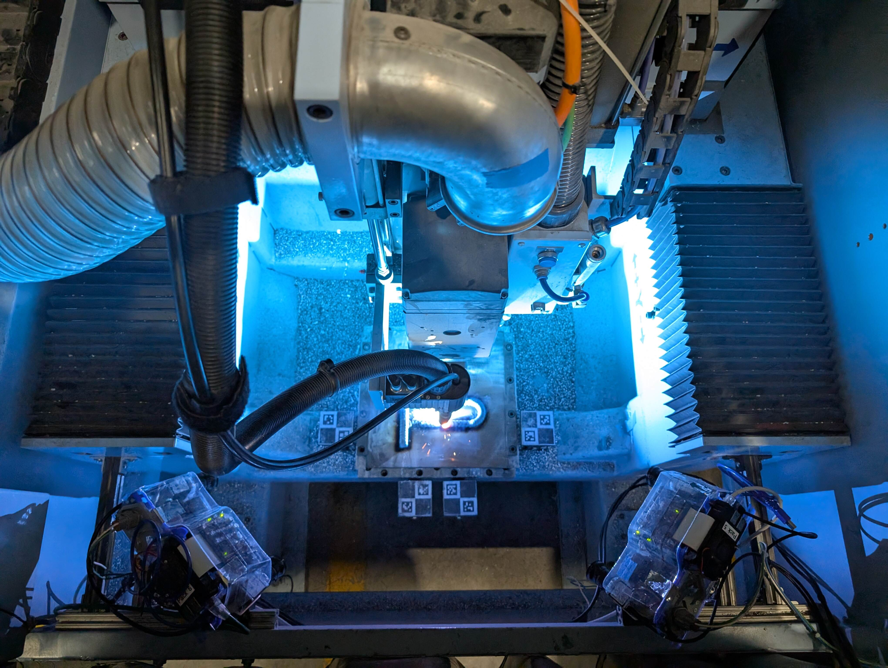
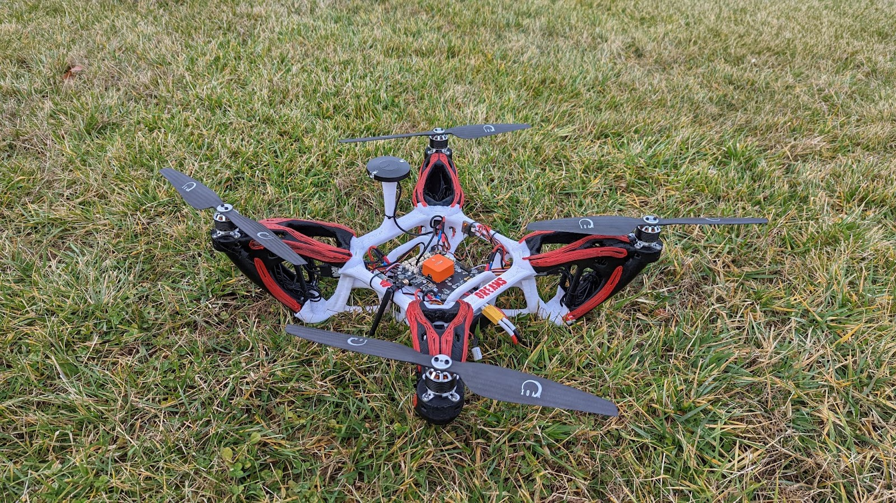
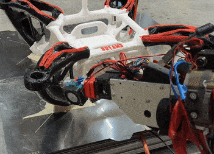

# Tadek Kosmal

PhD Candidate in Mechanical Engineering at Virginia Tech

My research lies at the intersection of **robotics, additive manufacturing, in-situ sensing, and computational fabrication**. I develop methods that allow manufacturing systems to measure what they have built, reason about geometric uncertainty, and automatically generate corrective actions.

I am completing my PhD in the [DREAMS Lab](https://dreams.mii.vt.edu/) under Professor [Christopher Williams](https://me.vt.edu/people/faculty/williams-christopher.html). My current work focuses on robotic hybrid manufacturing: converting sparse and occluded scan data into probabilistic, toolpath-ready geometry for automated repair and post-processing.

I am also a [SMART Scholar](https://www.smartscholarship.org/smart) with the U.S. Navy. I received my B.S. in [Mechanical Engineering](https://me.vt.edu/) with an additional major in [Robotics and Mechatronics](https://me.vt.edu/for-students/undergraduate/robotics-major.html) from Virginia Tech.

> Explore my technical work on the [projects page](/projects/), or view my [CV](/resume/).

## Research focus

  

    <h3>Adaptive manufacturing</h3>
    
Closed-loop workflows that connect robotic fabrication, inspection, geometric reasoning, and corrective process planning.

  

  

    <h3>Probabilistic geometry</h3>
    
Stochastic implicit surface reconstruction from sparse in-situ measurements, including the use of manufacturing-specific priors.

  

  

    <h3>Robotic toolpathing</h3>
    
Collision-aware and geometry-aware planning for additive, subtractive, and hybrid manufacturing operations.

  

## Selected work

  <article class="featured-row">
    

      
    

    

      
Hybrid manufacturing

      <h3>Adaptive Hybrid Manufacturing</h3>
      
In-situ scanning, stochastic surface reconstruction, and automatic generation of corrective machining paths for large-scale additive manufacturing.

      <a class="text-link" href="/projects/">Projects →</a>
    

  </article>

  <article class="featured-row">
    

      
    

    

      
Multi-axis AM

      <h3>Generative Multi-Axis Fabrication</h3>
      
Computational design and robotic deposition methods for manufacturing structures beyond conventional planar layer-by-layer constraints.

      <a class="text-link" href="/projects/">Projects →</a>
    

  </article>

  <article class="featured-row">
    

      
    

    

      
Conformal printing

      <h3>Conformal Reinforcement</h3>
      
Surface-aware toolpaths for depositing material directly onto existing components and complex non-planar substrates.

      <a class="text-link" href="/projects/">Projects →</a>
    

  </article>

